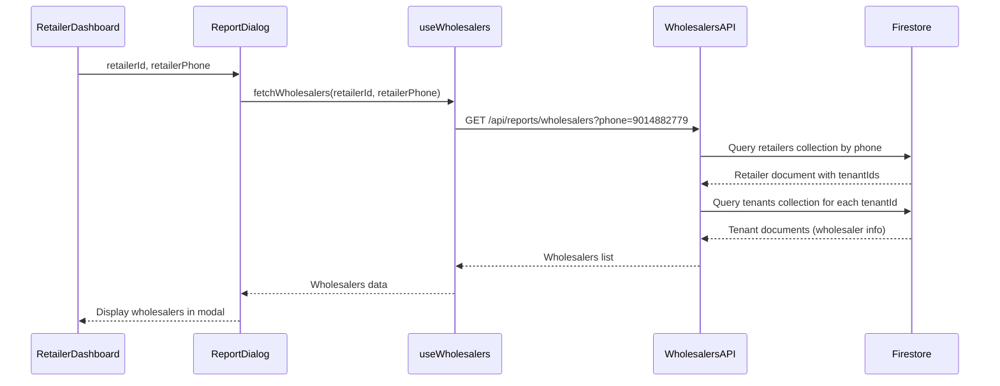

# 🔧 Retailer Dashboard Payment Report Issue - Complete Fix

## 📋 **Problem Summary**

The retailer dashboard's payment report modal was showing "No wholesalers found" instead of displaying the list of wholesalers that the retailer has made payments to.

## 🔍 **Root Cause Analysis**

### **Primary Issue: Missing Retailer Phone Parameter**
1. **ReportDialog Component**: Was being called with only `retailerId` but not `retailerPhone`
2. **API Dependency**: The wholesalers API requires the retailer's phone number to look up their associated tenants/wholesalers
3. **Data Flow Break**: Without the phone number, the API couldn't find the correct retailer and their tenant relationships

### **Secondary Issues Found**
1. **Limited Error Handling**: Basic error handling without detailed debugging information
2. **Single Data Source**: API only checked `retailers` collection, missing fallback to `retailerUsers`
3. **Poor Debugging**: Insufficient logging to trace the data flow

## 🛠️ **Fixes Implemented**

### **1. Fixed ReportDialog Component Call**
**File**: `/src/components/RetailerDashboard.tsx`

**Before:**
```typescript
{retailer && <ReportDialog retailerId={retailer.id} />}
```

**After:**
```typescript
{retailer && <ReportDialog retailerId={retailer.id} retailerPhone={retailer.phone} />}
```

**Impact**: ✅ Now passes the retailer's phone number to the ReportDialog component

### **2. Enhanced API Endpoint with Fallback Logic**
**File**: `/src/app/api/reports/wholesalers/route.ts`

**Improvements:**
- ✅ **Dual Collection Check**: First tries `retailers` collection, then falls back to `retailerUsers`
- ✅ **Better Tenant ID Handling**: Supports both `tenantIds` array and `tenantId` string
- ✅ **Enhanced Logging**: Detailed console logs for debugging
- ✅ **Robust Error Handling**: Graceful fallbacks with meaningful error messages

**Key Enhancement:**
```typescript
// First try retailers collection
const retailerQuery = query(retailersRef, where('phone', '==', phone))
const retailerSnapshot = await getDocs(retailerQuery)

if (!retailerSnapshot.empty) {
  // Found in retailers collection
} else {
  // Fallback to retailerUsers collection
  const cleanPhone = phone.replace(/\D/g, '')
  const retailerUid = `retailer_${cleanPhone}`
  const retailerUserDoc = await getDoc(doc(db, 'retailerUsers', retailerUid))
  // ... handle retailerUsers data
}
```

### **3. Enhanced useWholesalers Hook**
**File**: `/src/hooks/useWholesalers.ts`

**Improvements:**
- ✅ **Detailed API Logging**: Logs API URL, response status, and response data
- ✅ **Better Error Messages**: Includes response text in error messages
- ✅ **Debugging Information**: More detailed console logs for troubleshooting

### **4. Created Debug Tools**
**Files Created:**
- `/public/test-wholesalers.html` - Interactive testing interface
- `/public/test-wholesalers-api.js` - Browser console testing functions
- `/src/app/api/debug/retailer-data/route.ts` - Database inspection API
- `/src/app/api/init-super-admin/route.ts` - Test tenant creation API

## 🔄 **Data Flow After Fix**



## 🧪 **Testing & Verification**

### **Test the Fix**
1. **Open the retailer dashboard**
2. **Click the floating report button** (bottom-right corner)
3. **Verify wholesalers appear** in the modal
4. **Test different date ranges** and report generation

### **Debug Tools Available**
1. **Interactive Testing**: Navigate to `/test-wholesalers.html`
2. **Console Testing**: Load `/test-wholesalers-api.js` and run `testWholesalersAPI()`
3. **Database Inspection**: Call `/api/debug/retailer-data` to see current data

### **Expected Results**
- ✅ Wholesalers list appears in the modal
- ✅ "All Wholesalers" option available
- ✅ Individual wholesalers selectable
- ✅ Report generation works correctly
- ✅ CSV download functional

## 🔍 **Troubleshooting Steps**

### **If Still Not Working:**
1. **Check Console Logs**: Look for API call details and responses
2. **Run Debug API**: Visit `/test-wholesalers.html` and click "Debug Database"
3. **Verify Retailer Data**: Ensure retailer has `tenantIds` populated
4. **Check Tenants**: Verify tenants exist in the database
5. **Test Phone Number**: Ensure correct retailer phone number is being used

### **Common Issues & Solutions**
1. **No Tenants Found**: Create test tenant using the debug tool
2. **Wrong Phone Number**: Verify retailer phone format in database
3. **Empty tenantIds**: Check retailer document structure
4. **API Errors**: Check browser console for detailed error messages

## 📊 **Technical Details**

### **API Endpoint:**
```
GET /api/reports/wholesalers?phone={retailerPhone}
```

### **Response Format:**
```json
{
  "success": true,
  "data": {
    "wholesalers": [
      {
        "id": "tenant123",
        "name": "ABC Pharma",
        "email": "contact@abcpharma.com"
      }
    ]
  }
}
```

### **Data Relationships:**
- **Retailer** → **tenantIds[]** → **Tenants Collection** → **Wholesaler Info**

## ✅ **Fix Verification**

The fix addresses the core issue by:
1. **Passing the missing phone parameter** from RetailerDashboard to ReportDialog
2. **Implementing robust fallback logic** in the API to handle different data structures
3. **Adding comprehensive debugging** to trace data flow issues
4. **Creating testing tools** for easy verification

The retailer dashboard payment report should now correctly display the list of wholesalers that the retailer has made payments to, allowing them to generate comprehensive payment reports.