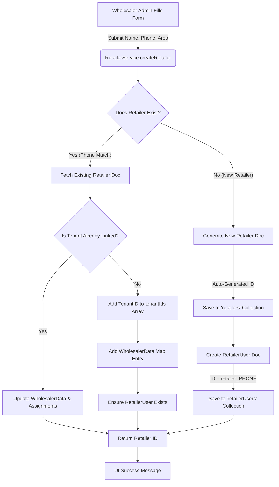

# Retailer Creation & Management Inventory

## 1. Retailer Creation Flow (Wholesaler Admin)

When a Wholesaler Admin creates a retailer, the system ensures distinct separation between the **Business Profile** and the **User Account** to support multi-tenant access (one retailer dealing with multiple wholesalers).

### **Process Flowchart**



### **Step-by-Step Breakdown**

1.  **Form Submission**: The Wholesaler Admin checks if the retailer exists (Phone Lookup) or enters details manually.
2.  **Uniqueness Check**: System queries `retailers` collection by `phone`.
3.  **Creation/Linkage**:
    *   **New Retailer**:
        *   Creates a `retailer` document (Auto-ID).
        *   Creates a `retailerUser` document (Phone-based ID).
    *   **Existing Retailer**:
        *   Does *not* create a new business profile.
        *   Updates the existing `retailer` doc to include the current Wholesaler's `tenantId` and specific settings (Area, Credit Limit, etc.) in `wholesalerData`.
4.  **Verification**: Since a Wholesaler created this account, `isVerified` is set to `true` automatically.

---

## 2. Data Models & Collections

We use **Two Separate Collections** to decouple the *Business Entity* from the *Authentication Credential*.

### **A. `retailers` Collection**
*   **Purpose**: Stores the **Business Profile**. This is the persistent entity containing history, transaction data, and wholesaler relationships.
*   **Document ID**: **Auto-Generated UUID** (e.g., `7f8a9d...`).
*   **Key Fields**:
    *   `profile`: `{ realName, phone, address, ... }` (Shared info).
    *   `tenantIds`: `['tenantA', 'tenantB']` (Array of all wholesalers this retailer works with).
    *   `wholesalerData`: Map keyed by `tenantId`. Stores wholesaler-specific configs.
        ```json
        "wholesalerData": {
          "tenantA": {
            "currentAreaId": "area123",
            "creditLimit": 50000,
            "currentBalance": 1200
          },
          "tenantB": { ... }
        }
        ```
    *   `verification`: `{ isPhoneVerified: true, verificationMethod: 'MANUAL' }`.

### **B. `retailerUsers` Collection**
*   **Purpose**: Stores the **Login Credential**. Serves as the mapping layer between a Phone Number (Login) and the Business ID.
*   **Document ID**: **Deterministic** (`retailer_` + Phone Number).
    *   Example: `retailer_9876543210`
*   **Key Fields**:
    *   `uid`: `retailer_9876543210`
    *   `phone`: `9876543210`
    *   `retailerId`: `7f8a9d...` (Link to the `retailers` doc).
    *   `isVerified`: `true`.
    *   `lastLoginAt`: Timestamp.

---

## 3. Login Behavior (First Time & Subsequent)

When the Retailer logs in via the Mobile App (PWA):

1.  **OTP Entry**: User enters Phone + OTP.
2.  **Auth Check (`retailerUsers`)**:
    *   System constructs ID `retailer_PHONE`.
    *   Fetches `retailerUsers` doc.
3.  **Profile Resolution**:
    *   Reads `retailerId` from the user doc.
    *   Fetches the actual `retailers` business document.
4.  **Dashboard Load**:
    *   The dashboard displays data based on the `retailers` doc.
    *   Since `tenantIds` contains the Wholesaler ID, the retailer sees that Wholesaler in their "Suppliers" list immediately.
    *   No setup required; they land directly on an active dashboard.

---

## 4. Mobile Number Change Strategy

Since the `retailerUsers` ID is tied to the phone number, changing a mobile number requires a migration process.

**Scenario**: Retailer wants to change login from `9876543210` to `9123456780`.

**Process:**
1.  **New User Doc**: Create a new document in `retailerUsers` with ID `retailer_9123456780`.
2.  **Linkage**: Set the new doc's `retailerId` to the **Existing** `retailerId` (`7f8a9d...`).
    *   *Result*: The new phone number now points to the *same* history, credit limits, and wholesaler relationships.
3.  **Profile Update**: Update the `phone` field inside the `retailers` document to `9123456780` for contact purposes.
4.  **Cleanup**: Deactivate or Delete the old `retailerUsers` document (`retailer_9876543210`) to prevent login with the old number.

**Wholesaler Association**:
*   **Remains Intact**. The Wholesaler is linked to the `retailers` ID. Since we didn't touch the `retailers` document ID or its `tenantIds` array, the relationship is 100% preserved. The Wholesaler doesn't even need to know the login credential changed; they just see the updated contact phone number.
