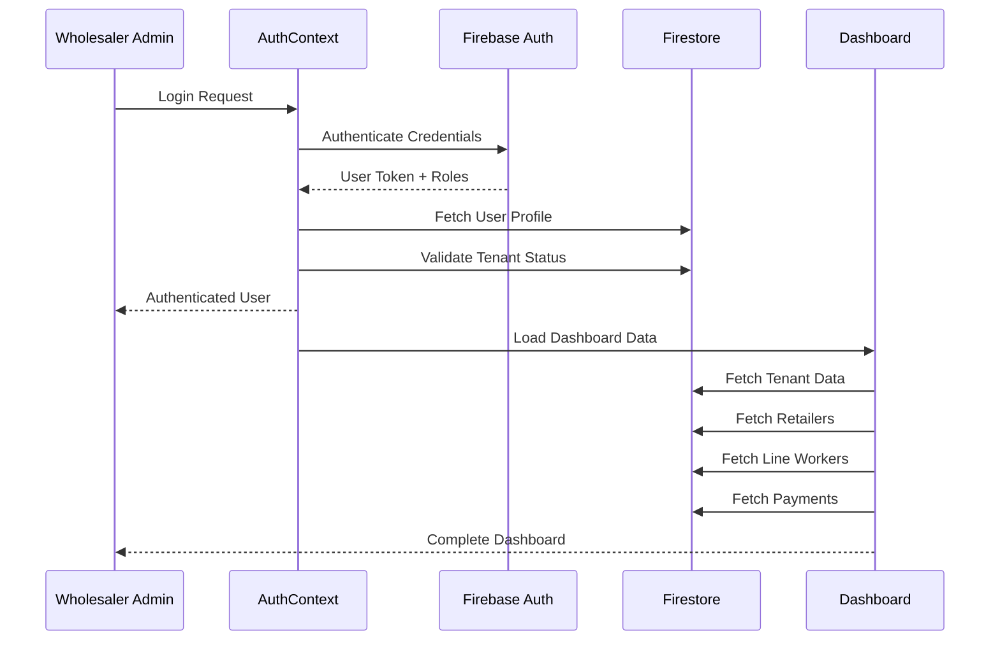

# 🔍 pHLynk Wholesaler Dashboard - Complete Security & Flow Analysis

## 📋 Executive Summary

The pHLynk wholesaler dashboard is a comprehensive B2B pharmaceutical supply chain management system with robust security measures and well-defined business flows. This analysis covers the complete functionality, use cases, and security considerations.

---

## 🏗️ **System Architecture Overview**

### **Multi-Tenant Architecture**
```
┌─────────────────────────────────────────────────────────────┐
│                    pHLynk System                           │
├─────────────────────────────────────────────────────────────┤
│  🔐 Authentication Layer                                    │
│  ├─ Firebase Auth (Email/Password, Phone)                   │
│  ├─ Role-Based Access Control (RBAC)                        │
│  └─ Multi-tenant Data Isolation                            │
├─────────────────────────────────────────────────────────────┤
│  🏢 Business Logic Layer                                   │
│  ├─ Wholesaler Dashboard                                   │
│  ├─ Retailer Management                                    │
│  ├─ Line Worker Coordination                               │
│  └─ Payment Collection & Verification                      │
├─────────────────────────────────────────────────────────────┤
│  💾 Data Layer                                             │
│  ├─ Firebase Firestore (Primary Database)                   │
│  ├─ Tenant-based Data Segmentation                         │
│  └─ Real-time Synchronization                             │
├─────────────────────────────────────────────────────────────┤
│  📱 Communication Layer                                    │
│  ├─ Firebase Cloud Messaging (FCM)                         │
│  ├─ Real-time Notifications                               │
│  └─ SMS Integration (Fast2SMS)                            │
└─────────────────────────────────────────────────────────────┘
```

---

## 👥 **User Roles & Permissions**

### **1. WHOLESALER_ADMIN**
**Primary dashboard user with comprehensive business management capabilities:**

#### **Core Permissions:**
- ✅ **Tenant Management**: Full control over their business tenant
- ✅ **Retailer Management**: Add, edit, assign, and manage retailers
- ✅ **Line Worker Management**: Create, assign areas, manage field staff
- ✅ **Area Management**: Define geographic service areas
- ✅ **Payment Oversight**: View all payment transactions and analytics
- ✅ **Analytics Access**: Business intelligence and reporting
- ✅ **Real-time Monitoring**: Live payment collection updates

#### **Data Access Scope:**
- **Own Tenant Data**: Complete access to tenant-specific data
- **Assigned Retailers**: All retailers assigned to their tenant
- **Payment History**: Complete payment transaction history
- **Analytics**: Business performance metrics

### **2. SUPER_ADMIN**
**System-level administrator with cross-tenant capabilities:**

#### **Additional Permissions:**
- ✅ **Multi-tenant Access**: View and manage all business tenants
- ✅ **User Creation**: Create new wholesaler accounts
- ✅ **System Configuration**: Global system settings
- ✅ **Cross-tenant Analytics**: System-wide business intelligence
- ✅ **Audit Access**: Complete system audit trails

---

## 🔄 **Complete Wholesaler Dashboard Flow**

### **1. Authentication & Authorization Flow**


### **2. Dashboard Initialization Flow**
```typescript
// 1. Authentication Check
const { user, isWholesalerAdmin } = useAuth();

// 2. Tenant Validation
const getCurrentTenantId = (): string => {
  return user?.tenantId || selectedTenant;
};

// 3. Data Fetching
useEffect(() => {
  if (isWholesalerAdmin && user?.uid && currentTenantId) {
    fetchDashboardData(); // Areas, Retailers, Workers, Payments
    setupRealtimeNotifications();
  }
}, [isWholesalerAdmin, user, selectedTenant]);

// 4. Real-time Updates
realtimeNotificationService.startListening(
  user.uid,
  'WHOLESALER_ADMIN',
  currentTenantId,
  handleNotificationUpdate
);
```

---

## 🎯 **Core Use Cases & Workflows**

### **1. 🏪 Retailer Management Use Cases**

#### **A. Add New Retailer**
**Flow:** Phone Verification → Profile Creation → Assignment

```typescript
// API Endpoint: POST /api/wholesaler/add-retailer
interface AddRetailerRequest {
  phone?: string;           // For creating new retailers
  retailerId?: string;      // For existing retailers
  tenantId: string;         // Wholesaler's tenant
  areaId?: string;          // Service area
  zipcodes?: string[];      // Service zip codes
  aliasName: string;        // Display name for wholesaler
  creditLimit?: number;     // Credit limit
  notes?: string;          // Additional notes
}
```

**Security Validations:**
- ✅ Tenant existence verification
- ✅ Phone number format validation
- ✅ Duplicate assignment prevention
- ✅ Credit limit business rules

#### **B. Assign Existing Retailer**
**Flow:** Phone Lookup → Profile Match → Assignment Creation

```typescript
// API Endpoint: POST /api/wholesaler/assign-retailer
interface AssignRetailerRequest {
  phone: string;
  tenantId: string;
  assignment: {
    aliasName: string;
    areaId?: string;
    zipcodes: string[];
    creditLimit?: number;
  };
}
```

**Security Features:**
- ✅ Retailer phone verification
- ✅ Assignment uniqueness check
- ✅ Tenant authorization validation

### **2. 👥 Line Worker Management Use Cases**

#### **A. Create Line Worker**
```typescript
// Creation Process
const lineWorkerData = {
  email: "worker@example.com",
  password: "securePassword",
  displayName: "John Doe",
  phone: "+919876543210",
  roles: ["LINE_WORKER"],
  assignedAreas: ["area1", "area2"],
  assignedZips: ["110001", "110002"]
};
```

#### **B. Area Assignment**
**Business Rules:**
- ✅ Each area assigned to only one line worker
- ✅ Zip code exclusivity enforcement
- ✅ Automatic retailer reassignment
- ✅ Conflict detection and resolution

### **3. 💳 Payment Collection Oversight**

#### **A. Real-time Payment Monitoring**
```typescript
// Real-time payment updates
const handleNotificationUpdate = (notifications) => {
  // Live payment collection updates
  // Line worker activity tracking
  // Retailer payment confirmations
};
```

#### **B. Payment Analytics**
**Metrics Tracked:**
- ✅ Daily/Weekly/Monthly collections
- ✅ Line worker performance
- ✅ Area-wise collection efficiency
- ✅ Retailer payment patterns

---

## 🔒 **Security Analysis & Vulnerabilities**

### **✅ Strong Security Measures**

#### **1. Authentication & Authorization**
```typescript
// Multi-layer authentication
- Firebase Auth with email/password
- Role-based access control (RBAC)
- Tenant-based data isolation
- Session management with automatic logout
```

#### **2. Data Protection**
```typescript
// Tenant isolation
interface BaseDocument {
  tenantIds: string[];        // Array-based multi-tenancy
  createdAt: Timestamp;
  updatedAt: Timestamp;
}

// Access control
const hasAccess = data.tenantIds.includes(tenantId);
```

#### **3. API Security**
```typescript
// Request validation
if (!tenantId) {
  return NextResponse.json({ error: 'Tenant ID required' }, { status: 400 });
}

// Tenant verification
const tenantDoc = await getDoc(doc(db, 'tenants', tenantId));
if (!tenantDoc.exists()) {
  return NextResponse.json({ error: 'Tenant not found' }, { status: 404 });
}
```

### **⚠️ Potential Security Concerns & Recommendations**

#### **1. API Authentication Gaps**
**Issue:** Some API routes lack proper authentication middleware

**Current State:**
```typescript
// Missing authentication checks
export async function POST(request: NextRequest) {
  const body = await request.json();
  // No user authentication verification
  // No tenant ownership validation
}
```

**Recommendation:**
```typescript
// Add authentication middleware
import { getServerSession } from 'next-auth';
import { auth } from '@/lib/firebase';

export async function POST(request: NextRequest) {
  // Verify user authentication
  const session = await getServerSession();
  if (!session) {
    return NextResponse.json({ error: 'Unauthorized' }, { status: 401 });
  }

  // Verify tenant ownership
  const user = await getUserFromSession(session);
  if (!user.tenantIds.includes(requestBody.tenantId)) {
    return NextResponse.json({ error: 'Forbidden' }, { status: 403 });
  }
}
```

#### **2. Input Validation Enhancements**
**Current State:** Basic validation exists but can be strengthened

**Recommendations:**
```typescript
// Enhanced validation
import { z } from 'zod';

const AddRetailerSchema = z.object({
  phone: z.string().regex(/^\d{10}$/), // Strict phone format
  tenantId: z.string().uuid(),           // UUID validation
  creditLimit: z.number().min(0).max(1000000), // Business limits
  zipcodes: z.array(z.string().regex(/^\d{6}$/)).max(50) // Reasonable limits
});
```

#### **3. Rate Limiting**
**Issue:** No rate limiting on sensitive operations

**Recommendation:**
```typescript
// Add rate limiting
import rateLimit from 'express-rate-limit';

const limiter = rateLimit({
  windowMs: 15 * 60 * 1000, // 15 minutes
  max: 100, // Limit each IP to 100 requests per windowMs
  message: 'Too many requests from this IP'
});
```

#### **4. Audit Logging**
**Current State:** Basic logging exists

**Enhancement Needed:**
```typescript
// Comprehensive audit logging
interface AuditLog {
  userId: string;
  tenantId: string;
  action: string;
  resource: string;
  timestamp: Timestamp;
  ipAddress: string;
  userAgent: string;
  success: boolean;
  errorMessage?: string;
}
```

---

## 🚀 **Performance Optimizations**

### **1. Data Fetching Optimizations**
```typescript
// Efficient data loading
const fetchDashboardData = async () => {
  // Parallel data fetching
  const [areas, retailers, workers, payments] = await Promise.all([
    areaService.getAll(tenantId),
    retailerService.getAll(tenantId),
    userService.getUsersByRole(tenantId, 'LINE_WORKER'),
    paymentService.getRecentPayments(tenantId)
  ]);
};

// Memoized filtering
const getFilteredRetailers = useMemo(() => {
  return retailers.filter(retailer => {
    // Efficient filtering logic
    return retailer.areaId === selectedArea;
  });
}, [retailers, selectedArea]);
```

### **2. Real-time Updates**
```typescript
// Efficient real-time synchronization
realtimeNotificationService.startListening(
  user.uid,
  'WHOLESALER_ADMIN',
  currentTenantId,
  handleNotificationUpdate
);
```

---

## 📊 **Business Intelligence Features**

### **1. Analytics Dashboard**
```typescript
interface DashboardStats {
  totalRevenue: number;
  todayCollections: number;
  topLineWorkers: Array<{
    id: string;
    name: string;
    amount: number;
  }>;
  areaPerformance: Array<{
    areaId: string;
    collectedAmount: number;
    retailerCount: number;
  }>;
}
```

### **2. Performance Metrics**
- ✅ Collection efficiency by area
- ✅ Line worker productivity
- ✅ Retailer payment patterns
- ✅ Daily/Weekly/Monthly trends

---

## 🔧 **Technical Implementation Details**

### **1. State Management**
```typescript
// Centralized state management
const [areas, setAreas] = useState<Area[]>([]);
const [retailers, setRetailers] = useState<Retailer[]>([]);
const [lineWorkers, setLineWorkers] = useState<User[]>([]);
const [payments, setPayments] = useState<Payment[]>([]);
const [dashboardStats, setDashboardStats] = useState<DashboardStats | null>(null);
```

### **2. Error Handling**
```typescript
// Comprehensive error handling
try {
  const result = await apiCall();
  showSuccess(result.message);
} catch (error) {
  console.error('Operation failed:', error);
  setError(error.message);
  showNotification('Operation failed', 'error');
}
```

### **3. Loading States**
```typescript
// User-friendly loading states
const mainLoadingState = useLoadingState();

// Show loading during data fetch
{mainLoadingState.isLoading && (
  <LoadingOverlay message="Loading dashboard data..." />
)}
```

---

## 📱 **Mobile Responsiveness & PWA**

### **1. Responsive Design**
- ✅ Mobile-first approach
- ✅ Touch-friendly interfaces
- ✅ Adaptive layouts
- ✅ Progressive enhancement

### **2. PWA Features**
- ✅ Offline functionality
- ✅ Push notifications
- ✅ App-like experience
- ✅ Background sync

---

## 🎯 **Summary & Recommendations**

### **✅ Strengths**
1. **Robust Architecture**: Well-structured multi-tenant system
2. **Comprehensive Features**: Complete business workflow coverage
3. **Real-time Capabilities**: Live updates and notifications
4. **Mobile Optimization**: Responsive design with PWA support
5. **Data Isolation**: Proper tenant separation

### **🔧 Recommended Improvements**

#### **High Priority**
1. **API Authentication**: Implement proper authentication middleware
2. **Input Validation**: Strengthen validation with Zod schemas
3. **Rate Limiting**: Add rate limiting to prevent abuse
4. **Audit Logging**: Comprehensive audit trail implementation

#### **Medium Priority**
1. **Performance Monitoring**: Add APM integration
2. **Error Tracking**: Implement Sentry or similar
3. **Automated Testing**: Add comprehensive test suite
4. **Documentation**: API documentation with Swagger

#### **Low Priority**
1. **Advanced Analytics**: Machine learning insights
2. **Integration APIs**: Third-party system integrations
3. **Advanced Reporting**: Custom report builder
4. **Mobile App**: Native mobile applications

---

## 🏆 **Conclusion**

The pHLynk wholesaler dashboard is a well-architected, feature-rich B2B application with strong business logic and user experience. The multi-tenant architecture provides proper data isolation, and the real-time features enable efficient business operations.

**Security Posture:** Good foundation with room for improvement in API authentication and input validation.

**Business Value:** Comprehensive solution that addresses real-world pharmaceutical supply chain challenges effectively.

**Technical Quality:** Modern React/Next.js implementation with proper state management and responsive design.

The system is production-ready with the recommended security enhancements implemented.