# PharmaLynk - Complete System Documentation

## 📋 Application Overview

**PharmaLynk** is a pharmaceutical distribution management platform that digitizes and streamlines the payment collection process between **wholesalers**, their **line workers (field agents)**, and **retailers (pharmacies/drug stores)**.

### 🎯 Business Problem Solved

In traditional pharmaceutical distribution:
- Wholesalers sell medicines on **credit** to retailers
- **Line workers** visit retailers daily to collect payments
- Cash handling is **error-prone** and lacks **transparency**
- **Tracking collections** across multiple line workers is difficult
- **Real-time visibility** into payments is non-existent
- **Managing company details** (QR codes, UPI) across field agents is manual and inconsistent

**PharmaLynk solves this by:**
1. Providing **real-time payment tracking** for wholesalers
2. Enabling **secure digital payment collection** (UPI/QR)
3. Giving **area-based assignment** of retailers to line workers
4. Creating **digital receipts** and **audit trails**
5. Offering **analytics** for business insights

---

## 👥 User Roles & Flows

### 1. 🏢 Wholesaler Admin

**Role**: Business owner who manages the distribution network

#### Key Responsibilities:
| Feature | Description |
|---------|-------------|
| **Profile Management** | Manage business details, multiple UPI IDs, and upload QR codes |
| **Area Management** | Create/edit service areas with zipcodes |
| **Retailer Management** | Add retailers, assign to areas |
| **Line Worker Management** | Create accounts, assign areas |
| **Payment Oversight** | View all transactions in real-time |
| **Analytics** | Track performance, collections, trends |

#### User Flow:


```mermaid
flowchart TD
    A[Login as Wholesaler] --> B[Dashboard Overview]
    B --> C[Settings / Profile]
    C --> C1[Add UPI IDs]
    C --> C2[Upload QR Codes]
    B --> D[Manage Network]
    D --> D1[Add Retailers]
    D --> D2[Add Line Workers]
    D --> D3[Assign Areas]
    B --> E[Monitor Collections]
```

#### Dashboard Features:
1. **Overview** - Stats cards, recent activity
2. **Settings** - **[NEW]** Manage Company Profile, UPI IDs (Primary/Secondary), and QR Codes with safety checks (unsaved changes warning)
3. **Areas** - Create/manage service areas
4. **Retailers** - Add retailers, view directory
5. **Line Workers** - Manage field agents
6. **Transactions** - Payment history
7. **Analytics** - Performance metrics

---

### 2. 👷 Line Worker

**Role**: Field agent who visits retailers to collect payments

#### Key Responsibilities:
| Feature | Description |
|---------|-------------|
| **View Assigned Retailers** | See retailers in assigned areas |
| **Collect Payments** | Record payment, show Wholesaler QR Code |
| **Optimized Collection** | Instantly record payments (Optimistic UI) |
| **Payment History** | Track own collections with receipts |
| **Receipts** | Generate/share visual payment receipts |

#### User Flow:
```mermaid
flowchart TD
    A[Login as Line Worker] --> B[View Assigned Retailers]
    B --> C[Select Retailer]
    C --> D[Collect Payment]
    D --> D1[Show Wholesaler QR/UPI]
    D --> E[Confirm Collection]
    E --> F[Instant Success (Optimistic UI)]
    F --> G[Share/Download Visual Receipt]
```

#### Key Improvements:
- **Instant Feedback**: Payment success screens appear immediately (Optimistic UI).
- **Accidental Close Prevention**: Forms and dialogs don't close if clicked outside.
- **Unified Receipts**: "View", "Share", and "Download" all use the same rich visual receipt modal.

---

### 3. 🏪 Retailer

**Role**: Pharmacy/drug store owner who receives payments

#### Key Responsibilities:
| Feature | Description |
|---------|-------------|
| **View Payment History** | See all transactions |
| **Multi-Wholesaler View** | Switch between different wholesalers |
| **Profile Management** | Update business details |
| **Download Receipts** | Access payment receipts |

---

## 🔧 Technical Improvements

### Performance Optimizations (Latest)
- **Parallel API Execution**: Payment creation, Notification sending (SMS/FCM), and Database updates now run in parallel.
- **Direct Cloud Functions**: Removed HTTP loopback overhead for internal implementation.
- **Optimistic UI Updates**: Dashboard state updates instantly upon action, removing wait times for re-fetching data.

### UX Enhancements
- **Deferred Uploads**: QR Code images are only uploaded when "Save" is clicked to prevent storage clutter.
- **Safety Warnings**: "Unsaved Changes" warning prevents leaving pages without saving work.
- **Consistent Dialogs**: All modals behave consistently (prevent outside click closure).

---

## ✅ Verified Features

| Feature | Wholesaler | Line Worker | Retailer |
|---------|------------|-------------|----------|
| Login/Logout | ✅ | ✅ | ✅ |
| Wholesaler Profile (QR/UPI) | ✅ | ✅ (View Only) | - |
| Create Areas/Retailers/Workers| ✅ | - | - |
| Assign Areas/Retailers | ✅ | - | - |
| Collect Payments (Optimized)| - | ✅ | - |
| Payment History | ✅ | ✅ | ✅ |
| Visual Receipts | ✅ | ✅ | ✅ |
| Real-time Notifications | ✅ | ✅ | ✅ |

---

## 🎥 Product Demo Highlights

This section provides a structured breakdown for a product demonstration video, highlighting the core problems, our solutions, and the specific benefits for each user role.

### 1. For Wholesalers (The Administrator)

**Problem:**
"Managing field collections is chaotic. I don't know who collected what until the end of the day. My line workers use their own personal UPIs or mess up the company QR codes, leading to accounting nightmares."

**Solution:**
**Centralized Profile & Real-Time Dashboard.**
The Wholesaler can now set a **Company Profile** with official UPI IDs and QR Codes. These automatically appear on every Line Worker's app.

**Why it works:**
It removes the dependency on the Line Worker's device settings. The standard operating procedure is enforced centrally.

**Benefits:**
- **Control:** You decide where the money goes (Official Company Account).
- **Visibility:** See payments instantly as they happen, not at EOD.
- **Professionalism:** Line workers present official company credentials (Logos, Address, GST).

### 2. For Line Workers (The Field Agent)

**Problem:**
"The app is slow. I'm standing in front of a busy retailer, internet is spotty, and I'm waiting for a loading spinner just to confirm a payment. Also, I sometimes accidentally close the form and lose the data."

**Solution:**
**Optimized Performance & improved UX.**
We implemented **Optimistic UI** updates—meaning the app responds *instantly* when you click "Collect", syncing in the background. We also added "Accidental Close Protection" so you never lose entered data.

**Why it works:**
It respects the Line Worker's time and working environment (often low connectivity).

**Benefits:**
- **Speed:** No awkward waiting time at the counter.
- **Reliability:** Background syncing ensures data isn't lost.
- **Ease of Use:** Visual receipts are generated instantly to share via WhatsApp/etc.

### 3. For Retailers (The Customer)

**Problem:**
"I pay multiple wholesalers. I lose track of which payment was for whom. Paper receipts get lost."

**Solution:**
**Digital Ledger & Visual Receipts.**
Retailers get a dedicated dashboard to view history per wholesaler.

**Why it works:**
It replaces the physical 'bahi-khata' (ledger) with a searchable, digital version.

**Benefits:**
- **Transparency:** "Trust but verify" - instant digital proof of payment.
- **Organization:** Filter payments by date or wholesaler.
- **Compliance:** Download official receipts for GST filing anytime.
