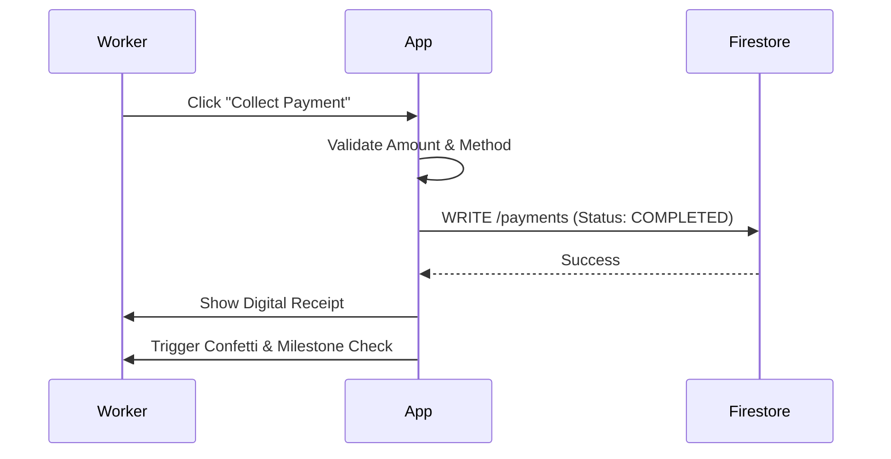

# PharmaLynk - System Knowledge Transfer & Architecture Documentation

## 📚 Introduction

**PharmaLynk** is a multi-tenant pharmaceutical distribution management platform connecting **Wholesalers**, **Field Agents (Line Workers)**, and **Retailers**. This document serves as a complete knowledge transfer resource for developers, covering the system architecture, data models, user flows, and extensive scalability/security verification reports.

---

## 🏗️ Architecture Overview

PharmaLynk uses a **Multi-Tenant Architecture** where:
*   **Wholesaler Admin**: The primary tenant owner.
*   **Line Worker**: A user assigned to ONE Wholesaler (Tenant).
*   **Retailer**: A unique business entity that can belong to **MULTIPLE Wholesalers**. This is the key "bridge" entity in the system.

### Core Tech Stack
*   **Frontend**: Next.js 14 (App Router), TypeScript, Tailwind CSS
*   **Authentication**: Firebase Auth (Phone + Email/Password)
*   **Database**: Cloud Firestore (NoSQL)
*   **State Management**: React Context + Firestore Realtime Listeners

---

## 📊 Data Models

### 1. 🏢 Tenant (Wholesaler)
Represents a distribution company.
```typescript
interface Tenant {
  id: string;
  name: string;
  plan: 'FREE' | 'PRO' | 'ENTERPRISE'; // Determines features
  status: 'ACTIVE' | 'SUSPENDED';
  adminIds: string[]; // List of user IDs who are admins
  createdAt: Timestamp;
}
```

### 2. 🏪 Retailer (The Multi-Tenant Entity)
Retailers are unique by phone number but can be "owned" by multiple wholesalers.
```typescript
interface Retailer {
  id: string; // Auto-generated
  name: string; // Business Name
  phone: string; // Unique Identifier for Auth
  
  // 🔐 Multi-Tenant Security Field
  tenantIds: string[]; // List of ALL wholesalers this retailer works with.
                     // Example: ["wholesaler_A", "wholesaler_B"]

  // 📦 Data Isolation Map
  // Key = tenantId. Value = Wholesaler-specific data.
  // Wholesaler A CANNOT see Wholesaler B's data here.
  wholesalerData: {
    [tenantId: string]: {
      currentAreaId?: string;
      currentZipcodes?: string[];
      creditLimit?: number;
      notes?: string;
      assignedAt: Timestamp;
    }
  };

  // 👷 Assignment Map
  // Key = tenantId, Value = Line Worker ID for THAT wholesaler.
  assignedLineWorkerId?: string; // Legacy/Fallback
  wholesalerAssignments: {
    [tenantId: string]: string; // "wholesaler_A": "worker_123"
  };
}
```

### 3. 👷 User (Line Worker / Admin)
Users are strictly scoped to a single tenant.
```typescript
interface User {
  id: string;
  tenantId: string; // Strict ownership
  roles: ['WHOLESALER_ADMIN'] | ['LINE_WORKER'] | ['SUPER_ADMIN'];
  name: string;
  
  // Line Worker Specific
  assignedAreas: string[]; // IDs of areas they cover
  assignedZips: string[];  // Specific zipcodes they cover
}
```

### 4. 💳 Payment
Payments are the core transactional unit.
```typescript
interface Payment {
  id: string;
  tenantId: string; // The wholesaler getting paid
  retailerId: string;
  lineWorkerId: string; // Who collected it
  amount: number;
  state: 'COMPLETED' | 'PENDING' | 'CANCELLED';
  method: 'CASH' | 'UPI' | 'CHEQUE';
  createdAt: Timestamp;
}
```

---

## 🔄 User Flows & Verification

### 1. The "Common Retailer" Scenario (Multi-Tenant Scale)
**Scenario**: Wholesaler A and Wholesaler B both sell to "City Pharmacy" (Phone: 9876543210).

*   **Step 1**: Wholesaler A adds "City Pharmacy".
    *   System creates Retailer Doc. `tenantIds: ["wholesaler_A"]`.
*   **Step 2**: Wholesaler B tries to add "City Pharmacy" (9876543210).
    *   System detects existing phone.
    *   Prompts Wholesaler B: "Retailer exists. Add to network?".
    *   **Action**: Updates Retailer Doc. `tenantIds: ["wholesaler_A", "wholesaler_B"]`.
*   **Result**: 
    *   Retailer logs in ONCE.
    *   Sees a "Switch Wholesaler" dropdown.
    *   Can view payment history for A and B separately.

### 2. Line Worker Assignment & Visibility Scope
**Scenario**: Line Worker "John" works for Wholesaler A in "North Zone".

*   **Authentication**: John logs in. `AuthContext` loads his profile (`tenantId: "wholesaler_A"`, `assignedAreas: ["north_zone_id"]`).
*   **Data Fetching**:
    *   Dashboard calls `retailerService.getAll("wholesaler_A")`.
    *   **Client-Side Filter**:
        1.  Is retailer directly assigned to John? (`wholesalerAssignments["wholesaler_A"] == "john_id"`) -> **SHOW**.
        2.  Is retailer in "North Zone"? -> **SHOW**.
        3.  Is retailer assigned to *someone else* in Wholesaler A? -> **HIDE**.
*   **Security**: John *cannot* see retailers that belong ONLY to Wholesaler B, because the initial fetch is scoped to `tenantId="wholesaler_A"`.

### 3. Super Admin Dashboard (Scalability Warning)
*   **Current State**: The Super Admin dashboard fetches **all collections** from all tenants to calculate global revenue.
*   **Bottleneck**: This determines `N` reads where `N = Total Payments in System`.
*   **Recommendation**: Move stats calculation to a scheduled Cloud Function (Node.js) that runs nightly/hourly and writes to a `system_stats` collection.

---

## 🛡️ Security Audit Findings

**Audit Date**: 2026-01-14
**Auditor**: Antigravity Agent

---

## 🔧 Technical Improvements

### Performance Optimizations
*   **Parallel API Execution**: Payment creation, Notification sending (SMS/FCM), and Database updates now run in parallel to reduce latency.
*   **Direct Cloud Functions**: Removed HTTP loopback overhead for internal implementation.
*   **Optimistic UI Updates**: Dashboard state updates instantly upon action (like "Collect Payment"), removing spinner wait times for field workers.

### UX Enhancements
*   **Deferred Uploads**: QR Code images are only uploaded when "Save" is clicked to prevent storage clutter.
*   **Safety Warnings**: "Unsaved Changes" warning prevents users from accidentally losing data.
*   **Consistent Dialogs**: Modals do not close on outside clicks, preventing data loss during field interruptions.

---

## 🎥 Product Demo Highlights (Script)

This section provides a structured breakdown for a product demonstration video.

### 1. For Wholesalers (The Administrator)
**Problem**: "Managing field collections is chaotic. I don't know who collected what until the end of the day."
**Solution**: **Centralized Profile & Real-Time Dashboard.**
*   **Action**: Show the Wholesaler setting up a Company Profile with official UPI IDs/QR Codes.
*   **Result**: Updates instantly appear on Line Worker apps.

### 2. For Line Workers (The Field Agent)
**Problem**: "The app is slow. internet is spotty. I lose data if I click wrong."
**Solution**: **Optimistic UI & Accidental Close Protection.**
*   **Action**: Click "Collect" -> Instant "Success" screen (background sync).
*   **Action**: Try clicking outside a form -> It stays open (Protection).

### 3. For Retailers (The Customer)
**Problem**: "I pay multiple wholesalers. Paper receipts get lost."
**Solution**: **Digital Ledger & Visual Receipts.**
*   **Action**: Retailer logs in -> Switches between "Wholesaler A" and "Wholesaler B".
*   **Result**: See separate, clean history for each.

---

## 🛡️ Security Audit Findings

| Component | Status | Finding |
| :--- | :---: | :--- |
| **Data Isolation** | ✅ Secure | Retailer's `wholesalerData` map prevents cross-tenant data leaks. |
| **Line Worker Scope** | ✅ Secure | Strictly scoped by `tenantId` in Firestore security rules & service queries. |
| **Payment Integrity** | ✅ Secure | Payments carry immutable `tenantId` and `retailerId`. |
| **Scalability** | ⚠️ Warning | Super Admin Dashboard ignores pagination/aggregation, risky for high scale. |

---

## 📈 Functional Flow Diagrams

### Wholesaler Operations
```mermaid
flowchart TD
    A[Wholesaler Login] --> B[Dashboard]
    B --> C{Manage Network}
    C -->|Create| D[Areas (Zones)]
    C -->|Invite| E[Retailers]
    C -->|Hire| F[Line Workers]
    F -->|Assign| G[Link Worker to Area/Retailer]
```

### Payment Collection Flow


---

## 🚀 Product Vision & Business Value

### ⚠️ The Root Pain Points
The pharmaceutical distribution industry works largely on **credit**.
1.  **Invisible Money**: Wholesalers have lakcs of rupees floating in the market with retailers, but no real-time view of where it is.
2.  **Cash Leakage**: Line workers collect huge cash amounts daily. Manual receipts led to "lost" cash, calculation errors, or fraud.
3.  **Trust Deficit**: Retailers argue about "I already paid that" vs Wholesalers saying "No entry in my book".
4.  **Operational Chaos**: Managing 50+ line workers and 2000+ retailers on paper/Excel is impossible to scale.

### 💡 How PharmaLynk Solves It
We digitize the **"Last Mile of Payment"**.
*   **Trust Protocol**: Every payment creates a digital handshake (Digital Receipt).
*   **Real-Time Ledger**: The moment a Line Worker collects ₹5000, the Wholesaler sees it. No waiting for evening settlement.
*   **Geographic Command**: We map the market into "Areas" and "Zones", giving Wholesalers military-like control over their territory.

### 🌟 Benefits by Role

#### 🏢 For Wholesalers (The Command Center)
*   **Zero Leakage**: See every penny collected in real-time.
*   **Field Force Efficiency**: Assign workers to specific zones (Zipcodes). Stop overlap, ensure coverage.
*   **Data-Driven Credit**: Know which Retailer pays on time and who defaults. Analytics drive better credit decisions.

#### 👷 For Line Workers (The Field Force)
*   **No More Arguments**: "Sir, see the app, you paid ₹2000 yesterday." Digital proof resolves disputes instantly.
*   **Automated Math**: No manual totaling of cash at the end of the day. The app does the math.
*   **Professional Identity**: Gives them a structured tool, elevating them from "collection boys" to "Field Agents".

#### 🏪 For Retailers (The Network)
*   **One App, All Suppliers**: Instead of different apps for different distributors, PharmaLynk creates a unified view. "City Pharmacy" manages payments to Wholesaler A, B, and C in one place.
*   **Transparent History**: Digital passbook of every payment made.
*   **Peace of Mind**: Instant download of receipts for accounting.

### 💎 Why Us? (The Competitive Edge)
1.  **Multi-Tenant by Design**: We don't just build for one wholesaler. We are building the **Network**. A retailer is added once and can serve the entire ecosystem.
2.  **Offline-First Architecture**: (Planned) Built for India's internet reality. Works even in basements and rural areas.
3.  **Security First**: OTP verification (optional) and strict data scoping means money tracking is watertight.

---

## 🛠️ Developer Cheatsheet

### Key Files
*   `src/services/firestore.ts`: **Core Data Layer**. Contains all the secure, tenant-scoped methods.
*   `src/contexts/AuthContext.tsx`: Handles user session and role-based redirects.
*   `src/components/RetailerDashboard.tsx`: complex logic for the multi-tenant retailer view.
*   `src/components/LineWorkerDashboard.tsx`: Implementing the visibility filtering logic.

### Common Tasks
1.  **Adding a Field to Retailer**: Update `Retailer` interface in `types/index.ts` AND update `wholesalerData` map to ensure it's isolated per tenant.
2.  **New Role**: Add entry to `src/components/RoleSelection.tsx` and updated `firestore.rules`.
3.  **Debugging**: Use `src/components/FCMDebugPanel.tsx` for notification issues.

---

## 🚀 Future Roadmap (Identified Gaps)

1.  **Offline Mode (PWA)**: Essential for field workers in poor network zones.
2.  **Bulk Import**: CSV upload for onboarding 1000+ retailers.
3.  **Stats Aggregation**: Creating the background job for Super Admin stats.
4.  **OTP Verification @ Collection**: Re-enabling strict OTP protocols where the Retailer must provide a code to the Line Worker to authorize high-value payments.
5.  **Payment Dispute Resolution**:
    *   **Retailer**: Can "Reject" a payment entry if incorrect.
    *   **Wholesaler**: Dashboard UI to view disputes and "Settle" them (void transaction or update amount).
6.  **Brand Discovery & Offline Ordering**:
    *   **Wholesalers**: Can tag themselves with medical brands they distribute (e.g., "Cipla", "Sun Pharma").
    *   **Retailers**: Can search by Brand Name to find new Wholesalers and initiate offline orders (via phone/WhatsApp).
7.  **Returns Management**:
    *   **Retailer**: Log a "Return Request" (medicine expiry/damage).
    *   **Wholesaler**: Receives request and assigns a Line Worker for pickup.
    *   **Line Worker**: "Collect Return" task appears in their dashboard.

---
*Generated by Antigravity Agent - 2026-01-14*
